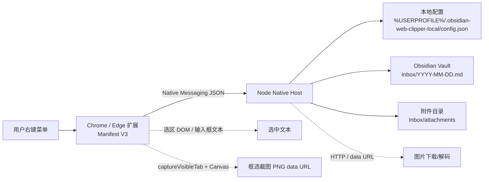
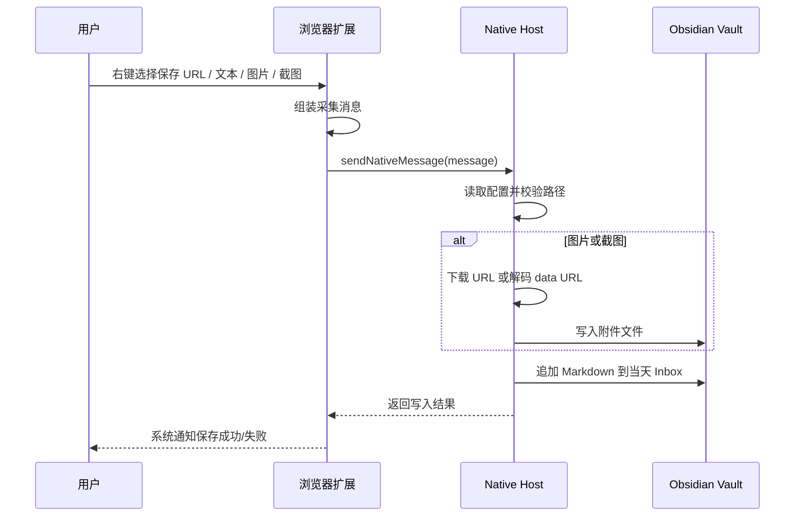

<div align="center">
  

# 移山 · Yishan

**把网页里的灵感，右键静默搬进 Obsidian。**

Windows + Chrome/Edge 本地网页采集器：保存 URL、选中文本、图片和框选截图到 Obsidian 当天 Inbox 日记。

[](./版本记录README.md)
[](#环境要求)
[](#安装浏览器扩展)
[](./package.json)
[](#写入效果)

</div>

---

## 为什么做

很多 Web Clipper 适合“整理一整篇文章”，但日常真正高频的是更轻的动作：看到一个链接、一段文字、一张图、一个局部截图，想立刻扔进当天笔记里，之后再整理。

**移山**的目标是：

- 不弹复杂表单。
- 不打断当前浏览。
- 不依赖云端服务。
- 直接写入本地 Obsidian Vault。
- 采集结果是长期可读的 Markdown 和图片附件。

同类项目常见结构会把 README 分成简介、快速开始、使用方式和开发说明；本项目也按这个方式组织，并额外加入本地 Native Messaging 架构图，方便以后维护。

## 功能亮点

| 能力 | 说明 |
| --- | --- |
| 保存页面 URL | 页面空白处右键，一键追加当前页面标题和链接。 |
| 保存选中文本 | 选中文本后右键保存，直接插入代码块；会优先读取网页代码块语言，并自动识别 JSON/HTML/CSS/JS/TS/Python/Shell/Markdown，失败回退 `text`。 |
| 保存图片 | 图片右键保存，Native Host 下载到附件目录，并写入 Obsidian 嵌入链接。 |
| 框选截图 | 页面右键后拖拽选择可见区域，裁剪为 PNG 附件。 |
| 本地静默写入 | Chrome/Edge 扩展通过 Native Messaging 调用本地 Node Host 写入 Vault。 |
| 设置页 | 在扩展选项页配置 Vault、Inbox 和附件目录。 |
| 追加保护 | 写入前处理空行和未闭合代码块，降低破坏当天日记的概率。 |

## 架构图



## 采集流程



## 写入效果

### URL

```markdown
- 08:30 [页面标题](https://example.com/article)
```

### 选中文本

````markdown
- 08:31 [页面标题](https://example.com/article)

```json
{
  "name": "yishan",
  "target": "Obsidian"
}
```
````

普通摘录会回退为 `text`；如果选中网页 `<pre>` / `<code>` 里的内容，会优先沿用页面提供的 `language-js`、`lang-python`、`data-language` 等语言标记。

### 图片或截图

```markdown
- 08:32 [页面标题](https://example.com/article)
  ![[20260429-083200-a1b2c3d4.png]]
  来源图片：https://example.com/image.png
```

截图来自 `data:image/png;base64,...` 时，只写入附件嵌入，不会把 base64 长串写进笔记。

## 项目结构

```text
.
├─ extension/                 # Chrome/Edge 扩展
│  ├─ background.js            # 右键菜单、采集、截图、Native Messaging
│  ├─ options.html/css/js      # 设置页
│  ├─ screenshot-crop.js       # 截图选区坐标归一化
│  └─ icons/                   # 扩展图标
├─ scripts/
│  └─ install-native-host.ps1  # 注册 Chrome/Edge Native Host
├─ src/host/                   # Node Native Host
│  ├─ index.ts                 # Native Messaging stdin/stdout 入口
│  ├─ native-protocol.ts       # 4 字节长度头协议编解码
│  ├─ host-request.ts          # 请求分发
│  ├─ config.ts                # 本地配置读写
│  ├─ markdown.ts              # Markdown 格式化
│  └─ vault-writer.ts          # Vault 写入和附件处理
├─ tests/                      # 无子进程派生的测试入口和用例
├─ README.md
└─ 版本记录README.md
```

## 环境要求

- Windows。
- Chrome 或 Microsoft Edge。
- Node.js `>= 24`。
- 一个本地 Obsidian Vault。
- PowerShell，用于注册 Native Host。

## 快速开始

### 1. 克隆仓库

```powershell
git clone https://github.com/bantubanjiu/yishan.git
cd yishan
```

### 2. 配置 Obsidian Vault

```powershell
node .\src\host\configure.ts "D:\path\to\Vault" Inbox Inbox\attachments
```

默认配置文件位置：

```text
%USERPROFILE%\.obsidian-web-clipper-local\config.json
```

### 3. 加载浏览器扩展

1. 打开 Chrome/Edge 扩展管理页。
2. 开启开发者模式。
3. 点击“加载已解压的扩展程序”。
4. 选择本仓库的 `extension/` 目录。
5. 复制扩展 ID。

### 4. 注册 Native Host

```powershell
.\scripts\install-native-host.ps1 -ExtensionId "<扩展ID>"
```

脚本会在当前用户 HKCU 下注册 Chrome 和 Edge 的 Native Messaging Host。

默认安装为**源代码联动模式**：浏览器启动 Native Host 时会直接运行当前仓库的 `src/host/handle-json-file.ts`。因此以后更新本仓库代码后，只要仓库路径不变，Native Host 会自动使用最新 Host 逻辑，不需要重复复制安装目录。

只有在你想让 Native Host 脱离仓库、固定使用安装当时的快照时，才使用：

```powershell
.\scripts\install-native-host.ps1 -ExtensionId "<扩展ID>" -Snapshot
```

如果移动了仓库目录、换了 Node.js 路径，或更换/重装浏览器扩展导致扩展 ID 改变，需要重新执行注册脚本。

## 使用方式

- 页面空白处右键：保存当前页面 URL。
- 选中文本右键：保存选中文本和来源链接，并直接插入自动适配语言的代码块。
- 图片上右键：下载图片并保存来源。
- 页面右键选择“框选截图保存到 Obsidian”：拖拽选择截图大小，松开鼠标后保存。
- 打开扩展“选项”：修改 Vault 路径、Inbox 目录和附件目录。

## 开发验证

```powershell
npm test
npm run check
```

等价命令：

```powershell
node tests\run-tests.mjs
node --check extension\background.js
```

> 当前环境中 `node --test` 会触发 `spawn EPERM`，所以项目提供了不派生子进程的 `tests/run-tests.mjs`。

## 版本记录

- 当前版本：`0.1.2`
- 详细更新历史见 [`版本记录README.md`](./版本记录README.md)。

## 路线图

- [ ] 支持更多截图模式，例如整页长截图。
- [ ] 支持本地时区日期写入，而不是 UTC 日期。
- [ ] 增加一键打开当天 Inbox 的入口。
- [ ] 增加可选的 Markdown 富文本保存模式。
- [ ] 增加安装/诊断脚本的错误提示和自动修复。

## 与官方 Obsidian Web Clipper 的区别

官方 Obsidian Web Clipper 更适合跨浏览器、模板化、文章级采集；移山更偏向个人本地工作流：

- 只面向 Windows + Chrome/Edge 的本地使用。
- 通过 Native Host 直接写本地 Vault。
- 优先追求“右键即保存”的低打扰体验。
- 默认按当天 Inbox 追加，适合先收集、后整理。

## License

当前仓库暂未声明开源许可证。公开使用、分发或协作前，建议补充 `LICENSE` 文件。
